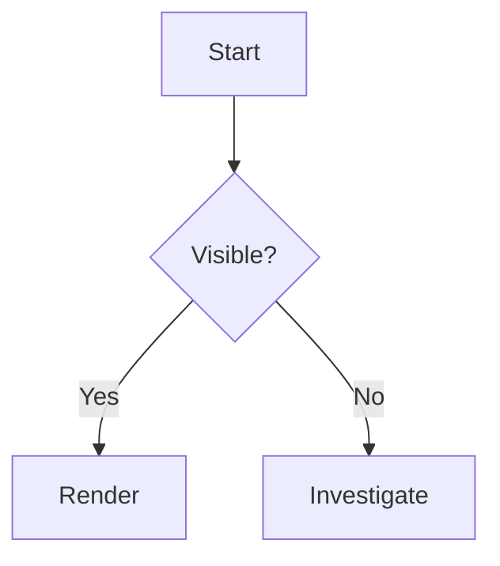

# Doclume Testing Suite Implementation Plan

> **For agentic workers:** REQUIRED SUB-SKILL: Use superpowers:subagent-driven-development (recommended) or superpowers:executing-plans to implement this plan task-by-task. Steps use checkbox (`- [ ]`) syntax for tracking.

**Goal:** Add a maintainable test suite that protects Doclume’s core markdown logic, web UI, VS Code UI, and sample/support content.

**Architecture:** Use Vitest for fast `packages/core` checks, Playwright for browser-level coverage of the web app and webview UI, and `@vscode/test-electron` for a thin VS Code extension smoke path. Keep canonical markdown fixtures in `tests/fixtures/` so every layer exercises the same inputs.

**Tech Stack:** TypeScript, Vitest, Playwright, `@vscode/test-electron`, pnpm, GitHub Actions.

---

### Task 1: Bootstrap the test tooling and scripts

**Files:**
- Modify: `package.json`
- Modify: `packages/vscode/package.json`
- Create: `vitest.config.ts`
- Create: `tests/setup/vitest.ts`
- Create: `tests/web/playwright.config.ts`
- Create: `tests/vscode/playwright.config.ts`

- [ ] **Step 1: Add the test dependencies**

Run:
```bash
pnpm add -Dw vitest jsdom @playwright/test @vscode/test-electron
```
Expected: `package.json` and the lockfile update cleanly.

- [ ] **Step 2: Add root test scripts**

Update `package.json` scripts to:
```json
{
  "scripts": {
    "test": "pnpm test:core && pnpm test:web && pnpm test:vscode",
    "test:core": "vitest run --config vitest.config.ts",
    "test:web": "playwright test --config tests/web/playwright.config.ts",
    "test:vscode:smoke": "node tests/vscode/smoke/run.mjs",
    "test:vscode:visual": "playwright test --config tests/vscode/playwright.config.ts",
    "test:vscode": "pnpm test:vscode:smoke && pnpm test:vscode:visual",
    "test:update-snapshots": "pnpm test:web -- --update-snapshots && pnpm test:vscode:visual -- --update-snapshots"
  }
}
```

- [ ] **Step 3: Add the VS Code webview preview script**

Update `packages/vscode/package.json` scripts to:
```json
{
  "scripts": {
    "preview:webview": "vite preview --host 127.0.0.1 --port 4175 --strictPort"
  }
}
```

- [ ] **Step 4: Add the Vitest config**

Create `vitest.config.ts`:
```ts
import { defineConfig } from 'vitest/config';

export default defineConfig({
  test: {
    environment: 'jsdom',
    globals: true,
    include: ['tests/core/**/*.test.ts', 'tests/content/**/*.test.ts'],
    setupFiles: ['tests/setup/vitest.ts'],
  },
});
```

- [ ] **Step 5: Add the shared Vitest setup**

Create `tests/setup/vitest.ts`:
```ts
import { afterEach, vi } from 'vitest';

afterEach(() => {
  document.body.innerHTML = '';
  document.documentElement.innerHTML = '<head></head><body></body>';
  vi.restoreAllMocks();
});
```

- [ ] **Step 6: Add the Playwright configs**

Create `tests/web/playwright.config.ts`:
```ts
import { defineConfig } from '@playwright/test';

export default defineConfig({
  testDir: './specs',
  use: {
    baseURL: 'http://127.0.0.1:4173',
    viewport: { width: 1440, height: 1200 },
    colorScheme: 'light',
    reducedMotion: 'reduce',
  },
  webServer: {
    command: 'pnpm --filter @doclume/web build && pnpm --filter @doclume/web preview -- --host 127.0.0.1 --port 4173 --strictPort',
    url: 'http://127.0.0.1:4173',
    reuseExistingServer: !process.env.CI,
    timeout: 120000,
  },
});
```

Create `tests/vscode/playwright.config.ts`:
```ts
import { defineConfig } from '@playwright/test';

export default defineConfig({
  testDir: './specs',
  use: {
    baseURL: 'http://127.0.0.1:4175',
    viewport: { width: 1440, height: 1200 },
    colorScheme: 'light',
    reducedMotion: 'reduce',
  },
  webServer: {
    command: 'pnpm --filter doclume build:webview && pnpm --filter doclume preview:webview',
    url: 'http://127.0.0.1:4175',
    reuseExistingServer: !process.env.CI,
    timeout: 120000,
  },
});
```

- [ ] **Step 7: Verify the bootstrap scripts are wired**

Run:
```bash
pnpm test:core
```
Expected: it runs Vitest and fails only because the test files do not exist yet.

- [ ] **Step 8: Commit**

Run:
```bash
git add package.json packages/vscode/package.json vitest.config.ts tests/setup/vitest.ts tests/web/playwright.config.ts tests/vscode/playwright.config.ts
git commit -m "test: bootstrap test tooling"
```

---

### Task 2: Add shared markdown fixtures

**Files:**
- Create: `tests/fixtures/index.ts`
- Create: `tests/fixtures/basic.md`
- Create: `tests/fixtures/rich.md`
- Create: `tests/fixtures/mermaid.md`
- Create: `tests/fixtures/sanitization.md`

- [ ] **Step 1: Create the fixture loader**

Create `tests/fixtures/index.ts`:
```ts
import { readFileSync } from 'node:fs';
import { dirname, resolve } from 'node:path';
import { fileURLToPath } from 'node:url';

const baseDir = dirname(fileURLToPath(import.meta.url));

function readFixture(name: string): string {
  return readFileSync(resolve(baseDir, name), 'utf8');
}

export const fixtures = {
  basic: readFixture('basic.md'),
  rich: readFixture('rich.md'),
  mermaid: readFixture('mermaid.md'),
  sanitization: readFixture('sanitization.md'),
} as const;
```

- [ ] **Step 2: Add the basic fixture**

Create `tests/fixtures/basic.md`:
```md
# Basic document

This is a short document for smoke coverage.

- one
- two
- three
```

- [ ] **Step 3: Add the rich fixture**

Create `tests/fixtures/rich.md`:
```md
# Reading confidence

## First section

A paragraph with a [link](https://example.com), `inline code`, and a small table.

| Name | Value |
| --- | --- |
| Alpha | 1 |
| Beta | 2 |

### Nested heading


```

- [ ] **Step 4: Add the Mermaid fixture**

Create `tests/fixtures/mermaid.md`:
```md
# Mermaid fixture


```

- [ ] **Step 5: Add the sanitization fixture**

Create `tests/fixtures/sanitization.md`:
```md
# Sanitization fixture

[bad link](javascript:alert('xss'))


```

- [ ] **Step 6: Verify the fixtures exist exactly where expected**

Run:
```bash
node - <<'NODE'
const fs = require('fs');
const files = ['basic.md', 'rich.md', 'mermaid.md', 'sanitization.md'];
const ok = files.every((name) => fs.existsSync(`tests/fixtures/${name}`));
console.log(ok ? 'fixtures-ok' : 'fixtures-missing');
NODE
```
Expected: `fixtures-ok`

- [ ] **Step 7: Commit**

Run:
```bash
git add tests/fixtures/index.ts tests/fixtures/basic.md tests/fixtures/rich.md tests/fixtures/mermaid.md tests/fixtures/sanitization.md
git commit -m "test: add shared markdown fixtures"
```

---

### Task 3: Add core and support-content tests

**Files:**
- Create: `tests/core/bootstrap.test.ts`
- Create: `tests/core/markdown.test.ts`
- Create: `tests/core/sanitize.test.ts`
- Create: `tests/core/stats.test.ts`
- Create: `tests/content/support-content.test.ts`

- [ ] **Step 1: Write the bootstrap test**

Create `tests/core/bootstrap.test.ts`:
```ts
import { describe, expect, it } from 'vitest';
import { bootstrapRoot } from '@doclume/core';

describe('bootstrapRoot', () => {
  it('throws when #root is missing', () => {
    document.body.innerHTML = '<div id="app"></div>';
    expect(() => bootstrapRoot(() => {})).toThrow('Doclume root element not found');
  });

  it('passes the root element to the renderer', () => {
    document.body.innerHTML = '<div id="root"></div>';
    let seen: HTMLElement | null = null;

    bootstrapRoot((root) => {
      seen = root;
    });

    expect(seen?.id).toBe('root');
  });
});
```

- [ ] **Step 2: Write the markdown and sanitization tests**

Create `tests/core/markdown.test.ts`:
```ts
import { describe, expect, it } from 'vitest';
import { extractToc, renderMarkdown, configureMarked } from '@doclume/core';
import { fixtures } from '../fixtures';

describe('markdown rendering', () => {
  it('renders headings and link markup from the rich fixture', () => {
    configureMarked();
    const html = renderMarkdown(fixtures.rich);
    expect(html).toContain('<h1 id="reading-confidence">Reading confidence</h1>');
    expect(html).toContain('https://example.com');
  });

  it('extracts a table of contents from the rich fixture', () => {
    const toc = extractToc(fixtures.rich);
    expect(toc.map((entry) => entry.text)).toEqual(['Reading confidence', 'First section', 'Nested heading']);
  });
});
```

Create `tests/core/sanitize.test.ts`:
```ts
import { describe, expect, it } from 'vitest';
import { sanitizeMarkdownImageUrl, sanitizeMarkdownLinkUrl } from '@doclume/core';

describe('sanitization', () => {
  it('blocks javascript links', () => {
    expect(sanitizeMarkdownLinkUrl('javascript:alert(1)')).toBe('#');
  });

  it('keeps safe https links', () => {
    expect(sanitizeMarkdownLinkUrl('https://example.com')).toBe('https://example.com');
  });

  it('blocks javascript image urls', () => {
    expect(sanitizeMarkdownImageUrl('javascript:alert(1)')).toBe('#');
  });
});
```

Create `tests/core/stats.test.ts`:
```ts
import { describe, expect, it } from 'vitest';
import { estimateReadingTime } from '@doclume/core';

describe('estimateReadingTime', () => {
  it('returns a reading estimate for a short document', () => {
    expect(estimateReadingTime('one two three four five six seven eight nine ten')).toEqual({
      words: 10,
      minutes: 1,
    });
  });
});
```

- [ ] **Step 3: Write the support-content test**

Create `tests/content/support-content.test.ts`:
```ts
import { readFileSync } from 'node:fs';
import { describe, expect, it } from 'vitest';
import { extractToc, renderMarkdown } from '@doclume/core';

const samplePaths = [
  'docs/samples/markdown-coverage.prompt',
  'docs/samples/markdown-coverage.instructions',
  'docs/samples/markdown-coverage.chatagent',
  'docs/samples/markdown-coverage.skill',
] as const;

describe('support content', () => {
  it('renders every shipped sample document', () => {
    const rendered = samplePaths.map((file) => renderMarkdown(readFileSync(file, 'utf8')));
    expect(rendered.every((html) => html.length > 0)).toBe(true);
    expect(extractToc(readFileSync(samplePaths[0], 'utf8')).length).toBeGreaterThan(0);
  });
});
```

- [ ] **Step 4: Run the core suite and fix any mismatches**

Run:
```bash
pnpm test:core
```
Expected: pass. If a test fails, decide whether the assertion is wrong or the implementation needs a fix.

- [ ] **Step 5: Commit**

Run:
```bash
git add tests/core/bootstrap.test.ts tests/core/markdown.test.ts tests/core/sanitize.test.ts tests/core/stats.test.ts tests/content/support-content.test.ts
git commit -m "test: add core and content coverage"
```

---

### Task 4: Add web Playwright smoke and screenshot tests

**Files:**
- Create: `tests/web/specs/reader.spec.ts`
- Create: `tests/web/specs/theme.spec.ts`
- Modify: `tests/web/playwright.config.ts` (if the first draft needs a different base URL or viewport)

- [ ] **Step 1: Write the first web smoke test**

Create `tests/web/specs/reader.spec.ts`:
```ts
import { expect, test } from '@playwright/test';

test('loads the sample document and shows the reading UI', async ({ page }) => {
  await page.goto('/');
  await page.getByRole('button', { name: /load sample/i }).click();

  await expect(page.getByRole('heading', { name: /reading confidence/i })).toBeVisible();
  await expect(page.getByText('This document exists to test that confidence.')).toBeVisible();
  await expect(page).toHaveScreenshot('web-sample.png', { fullPage: true });
});
```

- [ ] **Step 2: Write the theme-switching test**

Create `tests/web/specs/theme.spec.ts`:
```ts
import { expect, test } from '@playwright/test';

test('switches themes without breaking layout', async ({ page }) => {
  await page.goto('/');
  await page.getByRole('button', { name: /load sample/i }).click();
  await page.getByRole('button', { name: /change theme/i }).click();
  await page.getByRole('menuitemradio', { name: /console/i }).click();

  await expect(page.locator('html')).toHaveAttribute('data-theme', 'console');
  await expect(page).toHaveScreenshot('web-console-theme.png', { fullPage: true });
});
```

- [ ] **Step 3: Verify the web screenshots are stable**

Run:
```bash
pnpm test:web
```
Expected: the first run creates snapshots, and later runs pass unless the UI changes.

- [ ] **Step 4: Commit**

Run:
```bash
git add tests/web/playwright.config.ts tests/web/specs/reader.spec.ts tests/web/specs/theme.spec.ts
git commit -m "test: add web smoke and screenshot coverage"
```

---

### Task 5: Add VS Code extension smoke and webview visual tests

**Files:**
- Create: `tests/vscode/smoke/run.mjs`
- Create: `tests/vscode/smoke/index.js`
- Create: `tests/vscode/specs/viewer.spec.ts`
- Modify: `tests/vscode/playwright.config.ts` (if the first draft needs a different server path or init script)

- [ ] **Step 1: Add the VS Code smoke launcher**

Create `tests/vscode/smoke/run.mjs`:
```js
import path from 'node:path';
import { runTests } from '@vscode/test-electron';

await runTests({
  extensionDevelopmentPath: path.resolve('packages/vscode'),
  extensionTestsPath: path.resolve('tests/vscode/smoke/index.js'),
});
```

- [ ] **Step 2: Write the extension smoke test**

Create `tests/vscode/smoke/index.js`:
```js
const assert = require('node:assert/strict');
const fs = require('node:fs');
const os = require('node:os');
const path = require('node:path');
const vscode = require('vscode');

suite('Doclume smoke', () => {
  test('opens a prompt-like file in Doclume', async () => {
    const dir = fs.mkdtempSync(path.join(os.tmpdir(), 'doclume-smoke-'));
    const file = path.join(dir, 'smoke.prompt');
    fs.writeFileSync(file, '# Smoke\n\nThis is a smoke test.\n');

    const doc = await vscode.workspace.openTextDocument(vscode.Uri.file(file));
    await vscode.window.showTextDocument(doc);
    await vscode.commands.executeCommand('doclume.openPreview');

    const tabLabels = vscode.window.tabGroups.all.flatMap((group) => group.tabs.map((tab) => tab.label));
    assert.ok(tabLabels.some((label) => label.startsWith('Doclume: smoke.prompt')));
  });
});
```

- [ ] **Step 3: Write the webview visual test**

Create `tests/vscode/specs/viewer.spec.ts`:
```ts
import { expect, test } from '@playwright/test';

test.beforeEach(async ({ page }) => {
  await page.addInitScript(() => {
    const win = window as Window & {
      __DOCLUME_INIT__?: { markdown: string; theme: 'library' | 'lamplight' | 'manual' | 'console' | 'contrast' };
      acquireVsCodeApi?: () => { postMessage(msg: unknown): void };
    };

    win.__DOCLUME_INIT__ = {
      markdown: '# VS Code viewer\n\nThis is the webview screenshot fixture.',
      theme: 'manual',
    };
    win.acquireVsCodeApi = () => ({ postMessage() {} });
  });
});

test('renders the webview shell and content', async ({ page }) => {
  await page.goto('/');
  await expect(page.getByRole('heading', { name: /vs code viewer/i })).toBeVisible();
  await expect(page).toHaveScreenshot('vscode-viewer.png', { fullPage: true });
});
```

- [ ] **Step 4: Run the VS Code suite**

Run:
```bash
pnpm test:vscode
```
Expected: the smoke runner launches the extension host, and the Playwright webview test serves the built webview bundle.

- [ ] **Step 5: Commit**

Run:
```bash
git add tests/vscode/smoke/run.mjs tests/vscode/smoke/index.js tests/vscode/specs/viewer.spec.ts tests/vscode/playwright.config.ts
git commit -m "test: add vscode smoke and webview coverage"
```

---

### Task 6: Add CI and usage docs

**Files:**
- Create: `.github/workflows/testing.yml`
- Modify: `README.md`
- Modify: `packages/vscode/README.md`

- [ ] **Step 1: Add the workflow**

Create `.github/workflows/testing.yml` with four jobs:
```yaml
name: testing

on:
  pull_request:
  push:
    branches: [main]

jobs:
  typecheck:
    runs-on: ubuntu-latest
    steps:
      - uses: actions/checkout@v4
      - uses: pnpm/action-setup@v4
        with: { version: 9 }
      - uses: actions/setup-node@v4
        with:
          node-version: 20
          cache: pnpm
      - run: pnpm install --frozen-lockfile
      - run: pnpm typecheck

  core:
    runs-on: ubuntu-latest
    needs: typecheck
    steps:
      - uses: actions/checkout@v4
      - uses: pnpm/action-setup@v4
        with: { version: 9 }
      - uses: actions/setup-node@v4
        with:
          node-version: 20
          cache: pnpm
      - run: pnpm install --frozen-lockfile
      - run: pnpm test:core

  web:
    runs-on: ubuntu-latest
    needs: typecheck
    steps:
      - uses: actions/checkout@v4
      - uses: pnpm/action-setup@v4
        with: { version: 9 }
      - uses: actions/setup-node@v4
        with:
          node-version: 20
          cache: pnpm
      - run: pnpm install --frozen-lockfile
      - run: pnpm test:web

  vscode:
    runs-on: ubuntu-latest
    needs: typecheck
    steps:
      - uses: actions/checkout@v4
      - uses: pnpm/action-setup@v4
        with: { version: 9 }
      - uses: actions/setup-node@v4
        with:
          node-version: 20
          cache: pnpm
      - run: pnpm install --frozen-lockfile
      - run: pnpm test:vscode
```

- [ ] **Step 2: Document local test commands**

Update `README.md` with a short testing section that lists:
```md
- `pnpm test:core`
- `pnpm test:web`
- `pnpm test:vscode`
- `pnpm test`
- `pnpm test:update-snapshots`
```

Update `packages/vscode/README.md` with the VS Code-specific commands:
```md
- `pnpm --filter doclume build:webview`
- `pnpm test:vscode:smoke`
- `pnpm test:vscode:visual`
```

- [ ] **Step 3: Verify the workflow file is valid YAML and the docs mention the right commands**

Run:
```bash
ruby -e "require 'yaml'; puts YAML.load_file('.github/workflows/testing.yml') ? 'workflow-ok' : 'workflow-bad'"
```
Expected: `workflow-ok`

- [ ] **Step 4: Commit**

Run:
```bash
git add -f .github/workflows/testing.yml README.md packages/vscode/README.md
git commit -m "ci: add testing workflow"
```

---

## Self-review checklist

- Every spec requirement maps to at least one task:
  - UI regressions → Tasks 4 and 5
  - core logic coverage → Task 3
  - smoke flows → Tasks 4 and 5
  - support/content validation → Tasks 2 and 3
  - CI enforcement → Task 6
- No placeholder text like `TBD`, `TODO`, or `implement later`
- Screenshot baselines are committed from the start
- The suite stays moderate rather than becoming an all-or-nothing mega harness
