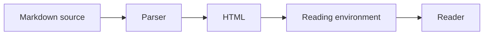
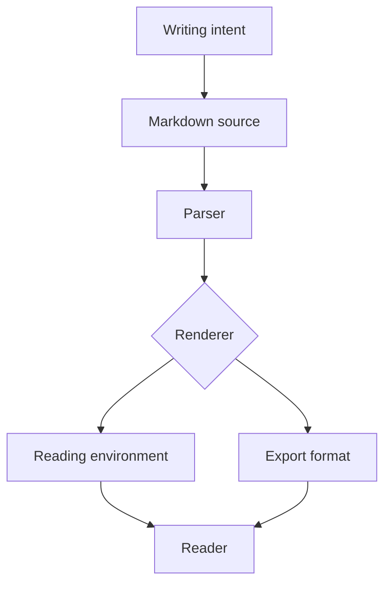

# On Reading Plainly

> "A good interface is like a good window — you don't see it. You see what's on the other side." — *paraphrased, from a notebook I lost in 2019*

There is a particular pleasure in reading something rendered well. Not flashy. Not skinned. Not dressed up in gradients and collaboration widgets and a notification counter you didn't ask for. Just **calm typography, generous margins**, and the quiet confidence that the page is on your side.

This document exercises that confidence. It is a coverage sample and a meditation at once — a structured test of Doclume's rendering behavior, written in the voice of something worth reading rather than something worth measuring.

## Why Markdown Still Matters

Markdown is the closest thing plain text has ever had to an international style guide. It is not a language in the formal sense. It is closer to a gentlemen's agreement — a shared set of punctuation habits that, rendered correctly, produce a legible document, and rendered incorrectly, still produce a legible document. That is a form of grace.

The case for markdown today is not that it is glamorous. It is not. The case is that it is:

- **portable** — the same `.md` file opens in a browser, a terminal, a GitHub README, and a dead-simple preview window without losing meaning
- **inspectable** — a person who has never heard of markdown can still read the source and understand the structure
- **durable** — text files outlast every proprietary format that has ever tried to replace them
- **humane** — writing in markdown imposes light structure without demanding that the author stop thinking about what they are trying to say
- **pleasantly boring in the best way** — nothing to configure, no schema to validate, no plugin ecosystem to manage

> [!NOTE]
> Markdown's portability is not accidental. It was designed to be readable in its raw form. When you write `**bold**`, any reader — human or machine — can tell that the word is emphasized. That relationship between form and meaning is rarer than it should be.

The AI era has not changed this arithmetic. If anything, it has sharpened it. When text can be generated at scale, the qualities that distinguish thoughtful writing — structure, precision, deliberate choice — become more legible through format, not less. A well-formed markdown document is a signal. It says someone was paying attention.

> [!IMPORTANT]
> Markdown is not a rendering format. It is a *writing* format that happens to render well. The distinction matters: when you write in markdown, you are making structural decisions, not aesthetic ones. Good rendering honors those decisions instead of overriding them.

## What Modern Tooling Gets Wrong

Most document software has developed a strange allergy to margin. The instinct seems to be: if space exists, fill it. Sidebars. Toolbars. Comment threads. Inline suggestions. A persistent header that reminds you which workspace you are in, as though you might otherwise forget.

The result is that **reading** becomes a side effect of the software rather than its purpose. You go to a document to read something and instead encounter a collaboration interface that happens to contain text.

> [!WARNING]
> Every proprietary document format carries a hidden dependency: the vendor's continued existence. Writers who keep their serious work in a SaaS editor are one acquisition, one pricing change, or one sunset announcement away from a format migration. Plain text files are owned by no one and readable by everything.

This is not a new problem. Writers have always had to fight their tools. But the modern version is subtler. The tools are not bad — they are, in many respects, impressive. The problem is that they are impressive in directions that do not serve reading. They are optimized for collaboration, for real-time updates, for comment resolution — all of which are occasionally useful and consistently distracting from the actual work of reading a document from top to bottom.

### The Ornamental Complexity Trap

There is a related failure mode, smaller but equally annoying: the tendency of preview tools to treat markdown rendering as a demonstration of the renderer rather than a service to the document. Tables with hover effects. Headings that pulse when you link to them. Syntax highlighting that supports seventeen languages the document never uses and misses the one it does.

> [!CAUTION]
> Novelty is not clarity. A renderer that adds animation to a code block is making a claim about what matters, and that claim is wrong. The code block's job is to be readable. Its job is not to be interesting.

Good rendering is invisible. You notice the document, not the software rendering it.

## What Doclume Is Trying to Do

Doclume is a markdown viewer. That sounds like a narrow description and is meant to be. It renders markdown and tries to stay out of the way.

The current reading environments:

| Theme | Character | Body type | Best for |
|:------|:----------|:----------|:---------|
| Library | Novel, light | Source Serif | Long-form prose |
| Lamplight | Novel, dark | Source Serif | Reading at night |
| Manual | Technical, light | Inter | Specs and references |
| Console | Technical, dark | Inter | Code-heavy documents |
| High Contrast | Accessible | System sans | Maximum legibility |

Each theme is a **complete reading environment** — font, spacing, line height, code colors. You do not pick a font and then pick a color scheme. You pick a context for reading, and the type comes with it.

> [!TIP]
> For technical documentation, try *Manual* during the day and *Console* at night. For long prose — an essay, a draft, a novel in progress — try *Library* or *Lamplight*. The themes are not aesthetic options. They are reading conditions.

## Typography and Inline Formatting

What follows exercises Doclume's rendering of every meaningful markdown construct — not as a mechanical checklist, but as a natural extension of the document's argument about text.

### Emphasis, Code, and Entities

A sentence uses **strong emphasis**, *italic emphasis*, ***both combined***, and ~~strikethrough~~. Escaped characters like \*literal asterisks\* and \_literal underscores\_ pass through correctly. HTML entities — &copy;, &amp;, &mdash; — render as expected. Combinations work too: **bold with `inline code` inside**, and *italic with ~~struck text~~ inside*.

Inline HTML extends what markdown alone cannot express: <mark>highlighted passages</mark>, <abbr title="GitHub Flavored Markdown">GFM</abbr> abbreviations, <kbd>Ctrl</kbd>+<kbd>S</kbd> keyboard shortcuts, superscripts like 10<sup>6</sup>, and subscripts like H<sub>2</sub>O.

### Heading Depth

#### H4: The Diminishing Return of Depth

##### H5: When Structure Becomes Bureaucracy

###### H6: When You Have Gone Too Far

Markdown supports six heading levels. Documents that use all six are making a claim about their own complexity that is usually unearned. That said, Doclume renders all of them correctly.

### Lists

Unordered lists compose naturally:

- **First-order** items breathe.
  - Second-order items align cleanly.
    - Third-order items do not get lost.
      - Fourth-order items are probably a mistake, but they render.

Ordered lists accept non-sequential source numbering and still render in order:

1. The document is parsed.
3. The structure is extracted.
7. The reading environment is applied.
2. The reader arrives.

Task lists track two states:

- [x] Render the markdown
- [x] Apply the theme
- [ ] Add a feature the software does not need

A list item can contain multiple paragraphs without breaking the visual structure.

- This is the first paragraph of a list item. It establishes the point.

  This is the second paragraph, still attached to the same bullet. It elaborates without requiring the reader to re-orient.

- The next item continues normally.

### Blockquotes

A standard blockquote:

> The function of good typography is not to draw attention to itself but to render the text fully legible and clear. — *Jan Tschichold, paraphrased*

A nested blockquote, for when the source already contains a quotation:

> The author wrote:
>
> > "Plain text is the only format that has no expiry date."
>
> That observation has aged well.

## Code and Its Rendering

Good code display is one of the places where reading software most frequently fails. The common failure modes: syntax highlighting that applies the wrong language rules, line wrapping that breaks indentation-sensitive code, and background colors that make it impossible to see cursor position during copy. Doclume tries to avoid all three.

Inline code like `npm run dev` or `git status --ignored` stays on the line without breaking.

```ts
type ThemeId = 'library' | 'lamplight' | 'manual' | 'console' | 'contrast';

export function applyTheme(id: ThemeId, root: HTMLElement): void {
  root.setAttribute('data-theme', id);
}
```

```bash
pnpm install
pnpm dev
pnpm build
```

```json
{
  "markdown": true,
  "gfm": true,
  "breaks": false,
  "footnotes": true
}
```

```diff
- old: preview-as-afterthought
+ new: reading-first, previewer-as-instrument
```

```html
<section aria-label="code sample">
  <h2>This is HTML inside a fenced block</h2>
  <p>It renders as code, not as markup.</p>
</section>
```



## Links and Their Promise

The web's original contract with text was about links. A word could become a door. Most modern document software makes links invisible — hoverable, trackable, colored differently depending on context, redirected through analytics middleware before they arrive where they said they were going.

Doclume renders links as links.

An [inline link](https://daringfireball.net/projects/markdown/) uses the standard syntax. A [reference link][doclume-ref] looks the same but pulls its destination from elsewhere in the document. An <https://commonmark.org> autolink wraps a URL without anchor text. A bare URL https://example.com may or may not be linked depending on whether GFM autolinks are enabled.

Email addresses get their own syntax: [send a message](mailto:hello@example.com). Anchor links [jump within the document](#code-and-its-rendering) without leaving it.

Images carry meaning through their alt text, not just their source:


[doclume-ref]: https://github.com/rabisnaqvi/doclume

## The Extended Syntax

Markdown's base specification leaves several useful constructs out. They have accumulated as extensions over the years. Doclume supports them.

### Footnotes

Footnotes are the typographer's aside.[^1] They offer a place for the elaboration that would interrupt the main argument if placed inline.[^2]

[^1]: In this case, a demonstration that footnotes render correctly — reference numbers link to notes, and notes anchor back to references.

[^2]: Footnotes in markdown use `[^label]` for references and `[^label]: text` for definitions. Any unique label works, not just numbers.

### Definition Lists

Doclume
: A markdown viewer optimized for reading. It renders markdown well and tries to stay out of the way.

Reading environment
: The combination of typeface, spacing, line height, and color that determines how a document feels to read.

Plain text
: A file format with no expiry date.

### Mathematical Notation

Display math renders via block syntax:

$$
\int_0^\infty e^{-x^2}\,dx = \frac{\sqrt{\pi}}{2}
$$

### Diagrams

Mermaid diagrams embed declarative graph notation and render as SVG:



### Raw HTML

Doclume passes a controlled set of HTML through the sanitizer. Structural:

<details>
<summary>On format boundaries</summary>

Doclume renders what markdown can express. When a construct requires a runtime or toolchain beyond a markdown parser — MDX components, live embeds, server-evaluated expressions — the document shows what it can and leaves the rest as text.

That is not a failure. That is the format doing its job.

</details>

Semantic inline elements: <kbd>Ctrl</kbd>+<kbd>K</kbd>, <abbr title="Table of Contents">TOC</abbr>, <mark>highlighted text</mark>, H<sub>2</sub>O, 2<sup>10</sup>.

### Format Boundaries

Some constructs require a runtime that markdown parsers do not provide:

<Alert tone="info">This is an MDX component. It requires a custom renderer or JSX-aware toolchain. A reading-first markdown viewer is not that toolchain, and does not pretend to be.</Alert>

When Doclume encounters something it cannot render, it does not error. It shows what it can and leaves the rest as text. That is not a failure. That is a format boundary — an honest statement about what the document contains and what the renderer supports.

## Tables and Alignment

Tables in markdown are, by some accounts, the worst part of the specification. They are syntactically fragile, hard to maintain in source form, and nearly impossible to read when cells contain long values. Despite all this, they appear in almost every technical document that makes it past the second draft.

| Feature | Example | Notes |
|:--------|:-------:|------:|
| Left aligned | text | the default |
| Center aligned | `code` | useful for symbols |
| Right aligned | ~~123~~ | numbers and dates |
| Inline HTML | <kbd>Esc</kbd> | keyboard references work in cells |

## Closing: The Case for Calm Software

There is a kind of software that does not announce itself. It opens. It shows you the thing you came to see. It closes when you are done. It does not ask you to rate the experience.

This is not a common ambition. Most software is designed to be *engaged with* — to produce sessions and retention and notifications and return visits. The document becomes a vehicle for that engagement rather than the thing itself.

Doclume is not trying to engage you. It is trying to show you a document. If that sounds like a small aspiration, consider how rarely any piece of software is content to be that modest.

Markdown helps. A `.md` file carries no instructions for how it should be presented — just structure: heading levels, emphasis, lists, links. The reading software decides what to do with that structure. Doclume's answer is: make it pleasant to read, and then get out of the way.

The format is not glamorous. It does not need to be. It has been here for two decades and it will be here for two more, long after the collaborative workspace platforms and the AI writing assistants and the design-system documentation generators have completed their natural cycles of acquisition and sunset. The text file will survive.

It always does.

---

*This document is a coverage sample and product demonstration for Doclume. It exercises CommonMark, GFM extensions (task lists, tables, strikethrough, autolinks), footnotes, definition lists, mathematical notation, Mermaid diagrams, and inline HTML — alongside an argument about reading, typography, and the future of plain text that was not strictly required by the specification.*
